<div align="center">


<br/>

[](https://www.oracle.com/java/)
[](https://spring.io/projects/spring-boot)
[](https://spring.io/projects/spring-cloud)
[](https://kafka.apache.org/)
[](https://redis.io/)
[](https://www.mysql.com/)
[](https://www.docker.com/)
[](LICENSE)

<br/>


</div>


## 📌 Overview

**SkyLedger** is a microservices-based airline reservation system designed to simulate the architecture and workflows found in modern airline reservation and **Global Distribution System (GDS)** platforms.

Instead of implementing the entire application as a single monolithic service, SkyLedger separates major airline business domains into independently deployable microservices.

The platform supports the complete airline booking lifecycle:

<div align="center">

**Flight Search → Fare Selection → Seat Availability → Booking → Payment → Confirmation → Notification**

</div>

The system uses **synchronous REST communication** for request-response operations and **Apache Kafka-based event-driven communication** for asynchronous workflows.

Distributed booking consistency is handled using the **Saga Pattern**, where services publish events and execute compensating actions when downstream operations fail.


## 🗂️ Table of Contents

<details>
<summary>Click to expand</summary>

- [Project Goals](#-project-goals)
- [System Architecture](#️-system-architecture)
- [Microservices](#-microservices)
- [Core Features](#️-core-features)
- [Saga-Based Distributed Transaction](#-saga-based-distributed-transaction)
- [Event-Driven Architecture](#-event-driven-architecture)
- [Security](#-security)
- [Redis Caching](#-redis-caching)
- [API Gateway](#-api-gateway)
- [Service Discovery](#-service-discovery)
- [Inter-Service Communication](#-inter-service-communication)
- [Resilience & Fault Tolerance](#️-resilience--fault-tolerance)
- [Payment Integration](#-payment-integration)
- [Notification System](#-notification-system)
- [Database Architecture](#️-database-architecture)
- [Technology Stack](#️-technology-stack)
- [Project Structure](#-project-structure)
- [End-to-End Booking Flow](#-end-to-end-booking-flow)
- [Testing](#-testing)
- [Docker Deployment](#-docker-deployment)
- [Local Development](#️-local-development)
- [API Endpoints](#-example-api-endpoints)
- [Architecture Patterns Used](#-architecture-patterns-used)
- [Key Engineering Challenges](#-key-engineering-challenges)
- [Future Enhancements](#-future-enhancements)
- [Learning Outcomes](#-learning-outcomes)
- [Screenshots](#-screenshots)
- [Author](#-author)

</details>


## 🎯 Project Goals

SkyLedger was designed to demonstrate practical understanding of:

- Microservices architecture
- Domain-driven service decomposition
- Distributed transactions
- Event-driven architecture
- Saga-based workflows
- API Gateway architecture
- Service discovery
- JWT security
- Role-based authorization
- Redis caching
- Inter-service communication
- Fault-tolerant distributed systems
- Containerized deployment

> The project focuses on **real-world backend architecture rather than simple CRUD implementation.**


## 🏗️ System Architecture

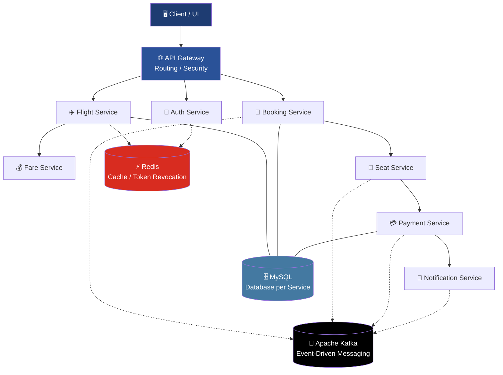


## 🧩 Microservices

SkyLedger is divided into independent business domains.

| Service | Responsibility |
|---|---|
| **API Gateway** | Central entry point, routing and cross-cutting concerns |
| **Eureka Server** | Service registration and discovery |
| **Auth Service** | Authentication, JWT generation and authorization |
| **Flight Service** | Flight schedules, routes and flight information |
| **Fare Service** | Fare calculation and pricing |
| **Seat Service** | Seat inventory and seat locking |
| **Booking Service** | Reservation lifecycle and booking management |
| **Payment Service** | Payment processing |
| **Notification Service** | Booking confirmation and notifications |

> The exact service list should be updated to match the services actually present in the repository.


## ✈️ Core Features

### 🔎 Flight Search

Users can search available flights using parameters such as:

- Source
- Destination
- Departure date
- Passenger count
- Flight availability

The Flight Service manages flight and schedule information independently.

### 💺 Seat Availability Management

The Seat Service manages:

- Seat inventory
- Seat status
- Seat selection
- Temporary seat locking
- Seat release after booking failure

Seat locking is particularly important for preventing multiple users from successfully booking the same seat.

### 💰 Fare Pricing

The Fare Service handles:

- Base fare
- Fare categories
- Passenger pricing
- Dynamic pricing logic
- Fare retrieval

Fare information is separated from flight and booking data to maintain independent domain ownership.

### 🎫 Booking & Reservation

The Booking Service manages the reservation lifecycle.

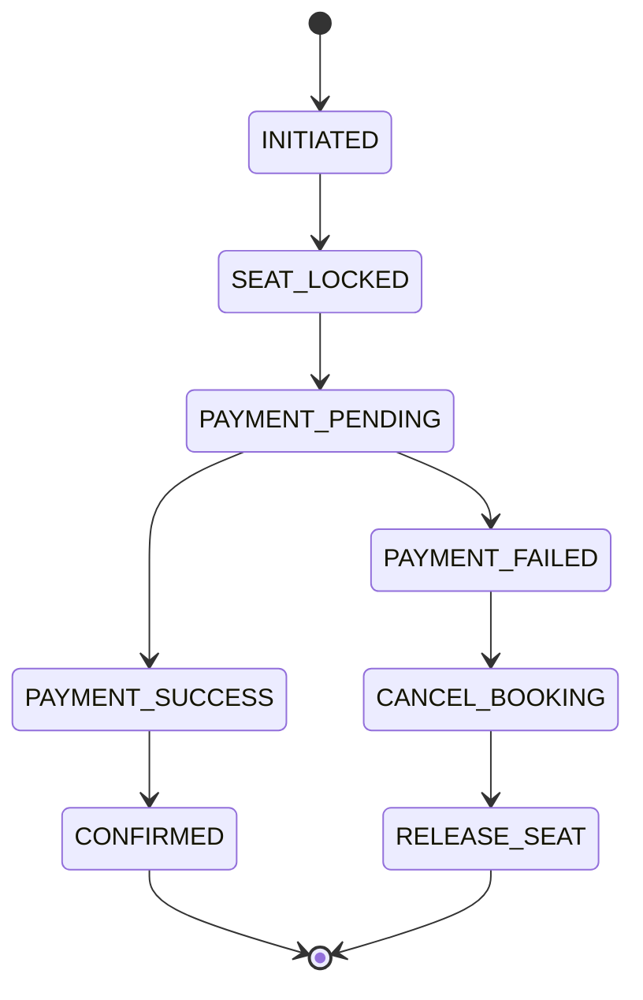


## 🔄 Saga-Based Distributed Transaction

Airline booking involves multiple services and therefore cannot rely on a traditional single-database transaction.

SkyLedger uses the **Saga Pattern** to coordinate the distributed booking workflow.

### Booking Saga

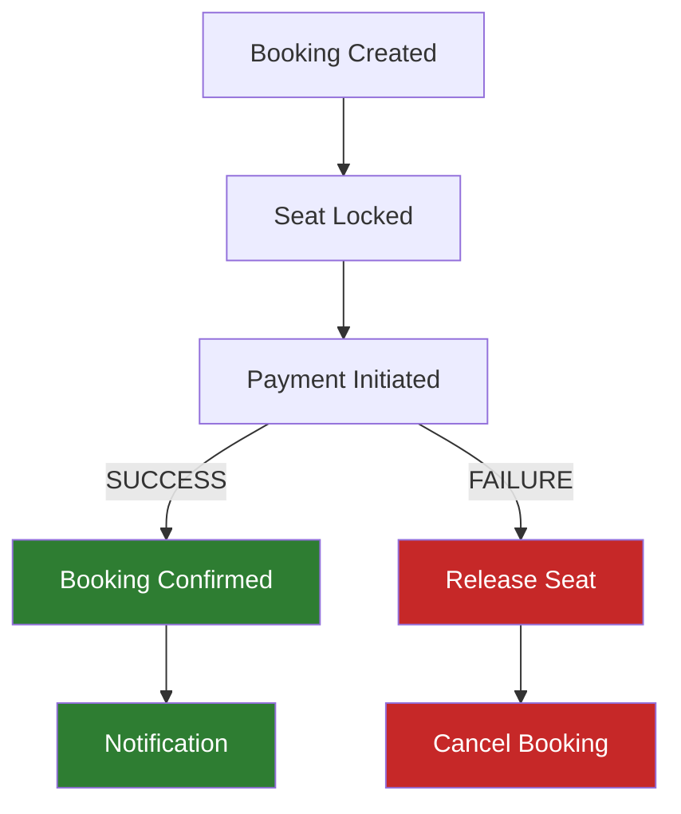

Each service performs its local transaction and publishes an event. If a downstream operation fails, previously completed operations can be compensated.

### Example — Payment Failure Compensation

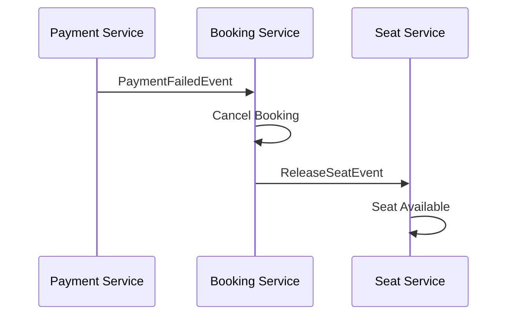

This avoids leaving the system in an inconsistent state such as:

```text
Payment Failed
      +
Seat Still Locked
      +
Booking Still Confirmed
```


## 📨 Event-Driven Architecture

SkyLedger uses **Apache Kafka** for asynchronous communication between services.

Example events include:

```text
BookingCreatedEvent
SeatLockedEvent
SeatReleasedEvent
PaymentInitiatedEvent
PaymentSuccessfulEvent
PaymentFailedEvent
BookingConfirmedEvent
BookingCancelledEvent
```

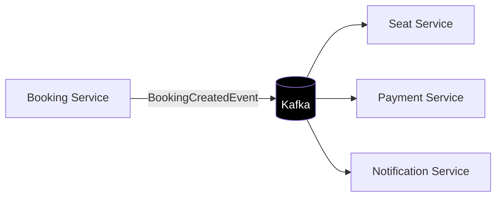

This reduces direct coupling between services and enables asynchronous processing.


## 🔐 Security

SkyLedger uses **Spring Security** with JWT-based authentication.

### Authentication Flow

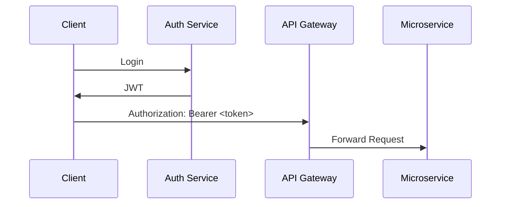

Security capabilities include:

- JWT authentication
- Role-based access control
- Protected REST endpoints
- Stateless authentication
- Token validation
- Token revocation using Redis

Example roles:

```text
ROLE_USER
ROLE_ADMIN
```


## ⚡ Redis Caching

Redis is used to reduce repeated database access for frequently requested information.

Potential cached data includes:

```text
Flight Search Results
Fare Information
Seat Availability
JWT Revocation / Blacklist
```

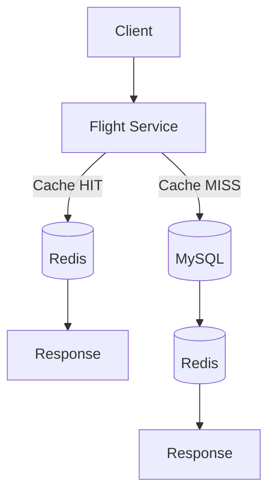

Cache invalidation is triggered when relevant booking or seat state changes.


## 🌐 API Gateway

The API Gateway acts as the single entry point into the distributed system.

Responsibilities include:

- Request routing
- Authentication filtering
- Authorization
- Service discovery integration
- Centralized cross-cutting concerns
- API abstraction

```text
/api/auth/**       → Auth Service
/api/flights/**    → Flight Service
/api/fares/**      → Fare Service
/api/seats/**      → Seat Service
/api/bookings/**   → Booking Service
/api/payments/**   → Payment Service
```


## 🔍 Service Discovery

SkyLedger uses **Netflix Eureka** for service registration and discovery.

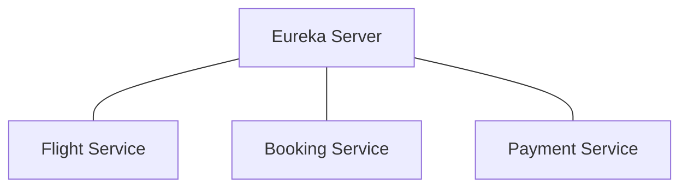

Services register themselves with Eureka, allowing other services and the API Gateway to locate them dynamically.


## 🔗 Inter-Service Communication

SkyLedger uses two communication mechanisms.

### Synchronous Communication — OpenFeign

Used when an immediate response is required.

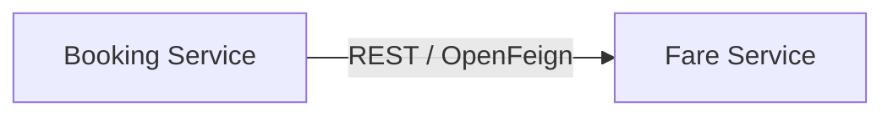

### Asynchronous Communication — Apache Kafka

Used for:

- Booking events
- Seat state changes
- Payment events
- Notification events
- Saga coordination

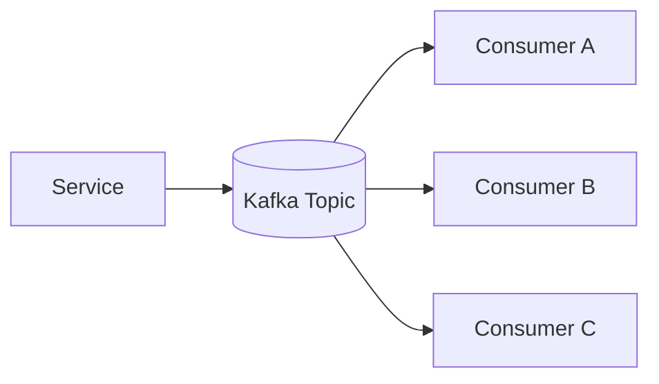


## 🛡️ Resilience & Fault Tolerance

Where implemented, SkyLedger uses **Resilience4j** for distributed-system resilience.

Patterns include:

- Circuit Breaker
- Retry
- Timeout handling
- Fallback mechanisms

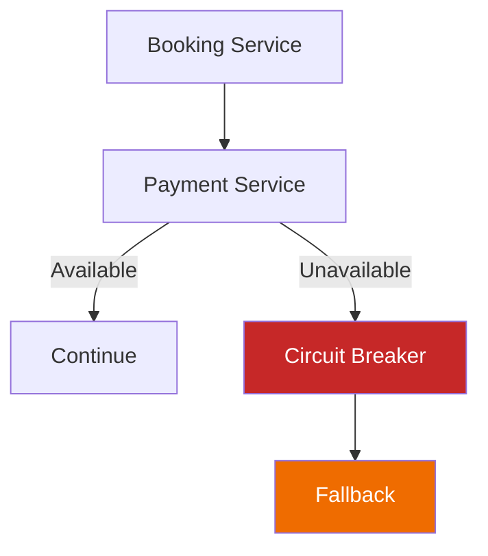


## 💳 Payment Integration

Where enabled, SkyLedger integrates **Razorpay** for payment processing.

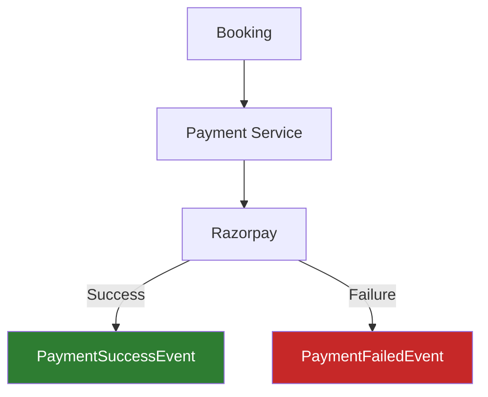

> Payment integration should only be documented as implemented if the repository contains the actual Razorpay integration.


## 📧 Notification System

The Notification Service handles post-booking communication.

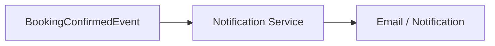

Possible notifications:

- Booking confirmation
- Payment confirmation
- Booking cancellation
- Payment failure


## 🗄️ Database Architecture

SkyLedger follows the **Database-per-Service** principle.

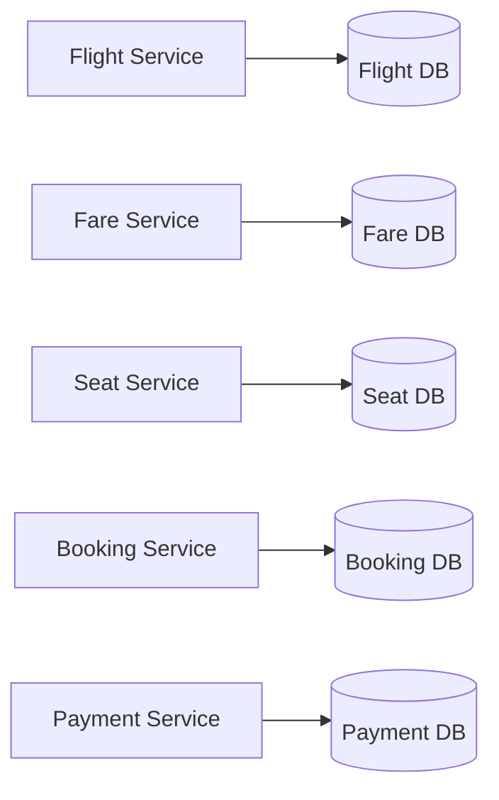

This provides:

- Service autonomy
- Reduced database coupling
- Independent schema evolution
- Better fault isolation
- Clear ownership of domain data


## 🛠️ Technology Stack

<div align="center">

| Category | Technologies |
|---|---|
| **Backend** | Java 17 · Spring Boot · Spring Cloud · Spring Security · Spring Data JPA · Hibernate · Maven |
| **Microservices** | Spring Cloud Gateway · Netflix Eureka · OpenFeign · Resilience4j |
| **Messaging** | Apache Kafka |
| **Database** | MySQL |
| **Caching** | Redis |
| **Security** | JWT · Spring Security · Role-Based Access Control |
| **DevOps** | Docker · Docker Compose · Google Jib · Spring Boot Actuator |
| **Integrations** | Razorpay · Email notification service |

</div>


## 📁 Project Structure

```text
SkyLedger/
│
├── api-gateway/
├── service-registry/
├── auth-service/
├── flight-service/
├── fare-service/
├── seat-service/
├── booking-service/
├── payment-service/
├── notification-service/
├── docker-compose.yml
├── README.md
└── docs/
    ├── architecture/
    ├── api/
    ├── database/
    └── diagrams/
```

> Rename these modules to exactly match the repository structure.


## 🔄 End-to-End Booking Flow

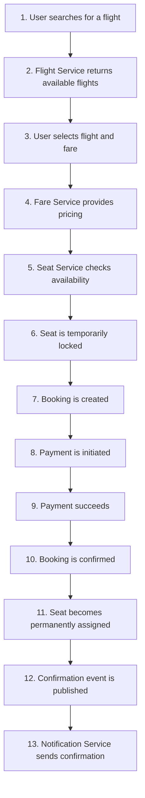

### Failure Scenario

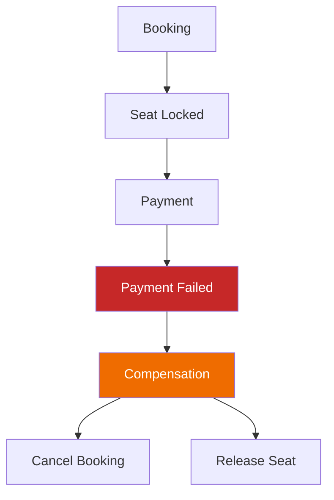


## 🧪 Testing

Testing strategy can include:

- Unit testing
- Controller testing
- Service-layer testing
- Repository testing
- Integration testing
- API testing
- Kafka event testing
- Security testing

Recommended tools:

```text
JUnit 5
Mockito
Spring Boot Test
MockMvc
Testcontainers
Postman
```


## 🐳 Docker Deployment

SkyLedger is designed to run as a collection of containerized services.

```text
Docker Compose
│
├── API Gateway
├── Eureka Server
├── Auth Service
├── Flight Service
├── Fare Service
├── Seat Service
├── Booking Service
├── Payment Service
├── Notification Service
├── Kafka
├── Zookeeper / Kafka Controller
├── Redis
└── MySQL
```

Start the complete environment:

```bash
docker compose up -d
```

Stop the environment:

```bash
docker compose down
```

View running containers:

```bash
docker compose ps
```


## ⚙️ Local Development

### Prerequisites

Install:

```text
Java 17+
Maven 3.9+
MySQL 8+
Redis
Apache Kafka
Docker
Docker Compose
Git
```

Verify Java:

```bash
java -version
```

Verify Maven:

```bash
mvn -version
```

### Clone Repository

```bash
git clone <YOUR_GITHUB_REPOSITORY_URL>
cd SkyLedger
```

### Configuration

Create the required environment variables or application configuration files.

Example:

```properties
spring.datasource.url=jdbc:mysql://localhost:3306/skyledger
spring.datasource.username=${DB_USERNAME}
spring.datasource.password=${DB_PASSWORD}

spring.data.redis.host=${REDIS_HOST}
spring.data.redis.port=${REDIS_PORT}

spring.kafka.bootstrap-servers=${KAFKA_BOOTSTRAP_SERVERS}

jwt.secret=${JWT_SECRET}
```

> ⚠️ Never commit: Passwords · JWT secrets · API keys · Razorpay keys · SMTP credentials · Database credentials


## 📡 Example API Endpoints

> Replace these examples with the actual endpoints implemented in the project.

<details>
<summary><b>Authentication</b></summary>

```http
POST /api/auth/register
POST /api/auth/login
POST /api/auth/logout
```
</details>

<details>
<summary><b>Flights</b></summary>

```http
GET /api/flights/search
GET /api/flights/{id}
```
</details>

<details>
<summary><b>Fares</b></summary>

```http
GET /api/fares/{flightId}
```
</details>

<details>
<summary><b>Seats</b></summary>

```http
GET /api/seats/{flightId}
POST /api/seats/lock
POST /api/seats/release
```
</details>

<details>
<summary><b>Bookings</b></summary>

```http
POST /api/bookings
GET /api/bookings/{id}
DELETE /api/bookings/{id}
```
</details>

<details>
<summary><b>Payments</b></summary>

```http
POST /api/payments/create
POST /api/payments/verify
```
</details>


## 📊 Architecture Patterns Used

| Pattern | Purpose |
|---|---|
| **Microservices** | Independent business services |
| **API Gateway** | Centralized request routing |
| **Service Discovery** | Dynamic service registration |
| **Database per Service** | Data ownership and isolation |
| **Saga Pattern** | Distributed transaction management |
| **Event-Driven Architecture** | Asynchronous communication |
| **Circuit Breaker** | Failure isolation |
| **Retry Pattern** | Temporary failure recovery |
| **Caching** | Reduce database load |
| **JWT Authentication** | Stateless authentication |
| **RBAC** | Role-based authorization |


## 🧠 Key Engineering Challenges

### 1. Distributed Transactions

A booking operation can span Booking, Seat, Payment, and Notification services. Since these services maintain independent databases, a traditional ACID transaction cannot span the entire workflow.

**Solution:** Saga-based orchestration/choreography with compensating operations.

### 2. Seat Concurrency

Multiple users may attempt to book the same seat simultaneously.

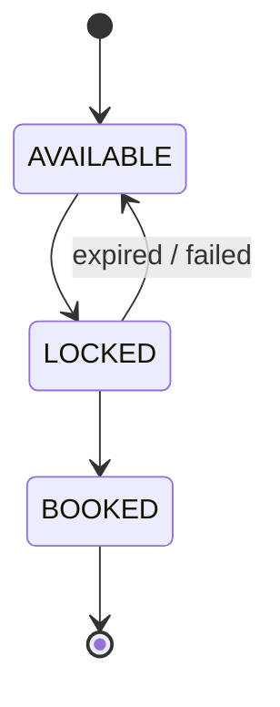

### 3. Service Failures

A downstream service may become unavailable during a booking request. Resilience patterns such as Timeout, Retry, Circuit Breaker, and Fallback can prevent failures from cascading through the system.

### 4. Cache Consistency

Cached flight, fare, and seat data can become stale. The system therefore requires appropriate cache invalidation when booking state changes.


## 📈 Future Enhancements

- Dynamic airline pricing
- Multi-airline inventory
- Multi-city booking
- Round-trip booking
- PNR generation
- Flight cancellation and rescheduling
- Refund workflows
- Loyalty/reward points
- Admin dashboard
- Real-time seat updates using WebSockets
- Distributed tracing
- Prometheus metrics
- Grafana dashboards
- ELK/OpenSearch centralized logging
- Kubernetes deployment
- CI/CD pipeline
- Testcontainers-based integration testing
- OpenTelemetry observability


## 📚 Learning Outcomes

Through SkyLedger, the project demonstrates practical experience with:

<table>
<tr>
<td valign="top" width="33%">

**Backend Engineering**
- Java
- Spring Boot
- REST APIs
- JPA/Hibernate
- Database design

**Distributed Systems**
- Microservices
- Service discovery
- API Gateway
- Distributed communication
- Distributed transactions

</td>
<td valign="top" width="33%">

**Event-Driven Systems**
- Kafka producers
- Kafka consumers
- Event-based workflows
- Saga pattern
- Compensation events

**Security**
- JWT
- Spring Security
- RBAC
- Token revocation

</td>
<td valign="top" width="33%">

**Performance**
- Redis caching
- Cache invalidation
- Database optimization

**DevOps**
- Docker
- Docker Compose
- Containerized services
- Jib
- Actuator

</td>
</tr>
</table>


## 📸 Screenshots

Add project screenshots to `/docs/screenshots/`

Recommended screenshots:

1. Login / Registration
2. Flight Search
3. Flight Results
4. Seat Selection
5. Booking Summary
6. Payment
7. Booking Confirmation
8. Admin Dashboard
9. Eureka Dashboard
10. Kafka Events
11. Docker Containers
12. API Gateway


## 🎥 Project Reference

This project was developed as a practical implementation of microservices, event-driven architecture, distributed transactions, and airline reservation domain concepts.

Reference: [Project Tutorial / Reference Video](https://youtu.be/yFoI4a3HbO0?utm_source=chatgpt.com)


## 👨‍💻 Author

<div align="center">

### **Vinoth**
Graduate Software Engineer  
Java | Spring Boot | Microservices | SQL | Angular

[](https://github.com/Vinoth1615)
[](https://www.linkedin.com/in/vinothkumardeva/)
[](https://vinoth-kumar-portfolio-eta.vercel.app/)

</div>


## ⭐ If You Find This Project Useful

Give the repository a ⭐ and feel free to explore the architecture, implementation, and distributed booking workflow.

## 📄 License

This project is licensed under the MIT License.


